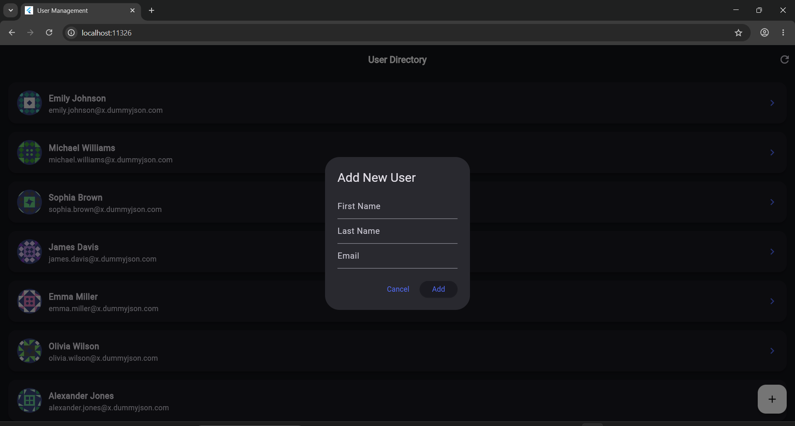
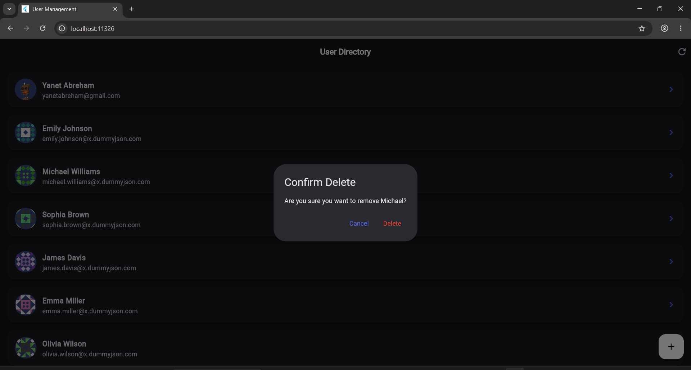

# CRUD API Consumption using Dio and BLoC State Management

A clean, scalable, and responsive Flutter user management application built using modern Flutter architecture principles. This project demonstrates professional separation of concerns through BLoC state management and RESTful API integration using Dio.

🚀 Overview

This application connects to the DummyJSON API to perform full CRUD (Create, Read, Update, Delete) operations on user data. It showcases reactive UI updates, structured business logic handling, and efficient asynchronous networking using the BLoC pattern.

The architecture focuses on maintainability, scalability, and production-style code organization.

🛠️ Tech Stack & Architecture

**Framework:** Flutter  
**State Management:**  flutter_bloc – Used for predictable and reactive state management.  
**Networking:**  Dio – Handles GET, POST, PATCH, and DELETE requests with advanced networking capabilities.  
**Architecture Pattern:**  BLoC (Business Logic Component)  
**Data Modeling:**  Custom Dart model classes with JSON serialization.  

✨ Key Features

**Live API Integration:**  Automatically fetches users from a remote REST API on startup.  
**Reactive State Management:**  Uses BLoC events and states to rebuild the UI dynamically.  
**Full CRUD Operations:**  Supports creating, updating, deleting, and retrieving users.  
**Optimistic UI Experience:**  Updates the interface instantly while syncing with the backend.  
**Structured Error Handling:**  Handles API failures, invalid responses, and loading states cleanly. 
**Scalable Architecture:**  Organized layers for maintainable and production-ready development.  

📱 Application Demo & Previews

🔍 Interactive User Directory (Fetch State)

The main dashboard consumes API data through BLoC state streams, dynamically rendering reusable user profile components.


⚡ CRUD Lifecycle Workflows

| ➕ Create User Profile | 🆕 Created User Result |
|---|---|
| **Validated Inputs:** Uses structured form validation before dispatching create events to the BLoC layer. | **Live UI Update:** Newly created users instantly appear in the interface through reactive BLoC state updates. |
|  |  |

| ⚙️ Edit or Delete Action Bar | 🗑️ Delete Confirmation |
|---|---|
| **Contextual Actions:** Provides edit and delete operations through a clean modal interaction system. | **Protected Actions:** Prevents accidental removals using confirmation dialogs before deletion. |
|  |  |

| 🚀 Swipe-to-Delete Interaction |
|---|
| **Smooth Native UX:** Uses `Dismissible` widgets integrated with BLoC events for instant visual feedback. |
|  |

📂 Project Structure

```text

lib/
├── core/
│   ├── constants/
│   │   └── api_constants.dart
│   │
│   └── network/
│       └── dio_client.dart
│
├── features/
│   └── users/
│       ├── data/
│       │   ├── datasources/
│       │   │   └── user_remote_datasource.dart
│       │   │
│       │   ├── models/
│       │   │   └── user_model.dart
│       │   │
│       │   └── repositories/
│       │       └── user_repository.dart
│       │
│       └── presentation/
│           ├── bloc/
│           │   ├── user_bloc.dart
│           │   ├── user_event.dart
│           │   └── user_state.dart
│           │
│           └── screens/
│               └── home_screen.dart
│
└── main.dart

```
📋 Requirements

- Flutter SDK
- Dart SDK
- Android Studio or VS Code
- Emulator or Physical Device

 📦 Main Dependencies

```yaml
flutter_bloc: ^9.0.0
dio: ^5.9.2
equatable: ^2.0.7
```

🔧 How to Run

Follow these steps to get the project running on your local machine:

```bash
# 1. Clone the repository
git clone https://github.com/Yanet-Abreham/flutter-BLOC-Dio-crud.git

# 2. Navigate into the project folder
cd flutter-BLOC-Dio-crud

# 3. Install dependencies
flutter pub get

# 4. Run the application
flutter run
